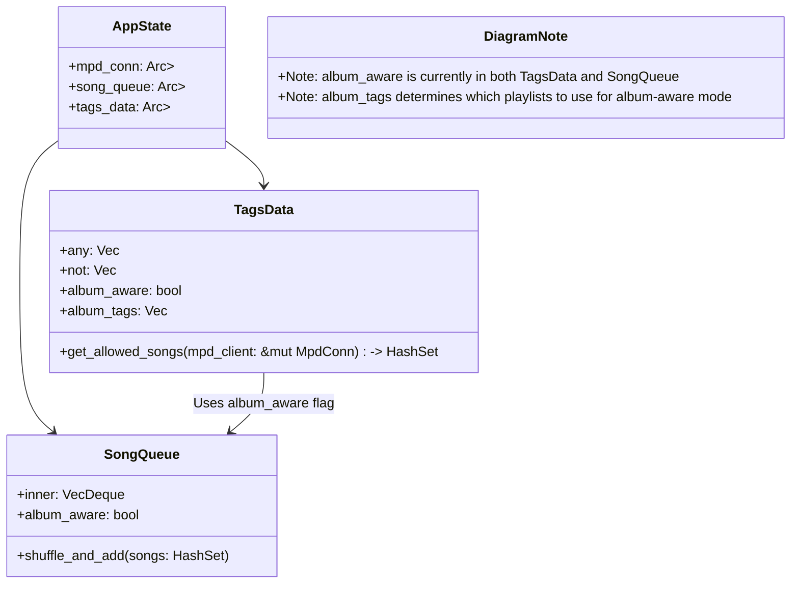

# Album-Aware Mode Architecture

## Current Architecture



## Proposed Architecture

```mermaid
classDiagram
    class AppState {
        +mpd_conn: Arc<RwLock<MpdConn>>
        +song_queue: Arc<RwLock<SongQueue>>
        +tags_data: Arc<RwLock<TagsData>>
        +album_aware: bool  # Moved from TagsData to AppState
    }

    class TagsData {
        +any: Vec<String>
        +not: Vec<String>
        +get_allowed_songs(mpd_client: &mut MpdConn) -> HashSet<HashableSong>
    }

    class SongQueue {
        +inner: VecDeque<mpd::Song>
        +shuffle_and_add(songs: HashSet<HashableSong>)
    }

    AppState --> TagsData
    AppState --> SongQueue

    class DiagramNote {
        +Note: album_aware moved to AppState as a separate setting
        +Note: All decision-making goes through tags in TagsData
        +Note: Simpler architecture with clearer separation of concerns
    }
