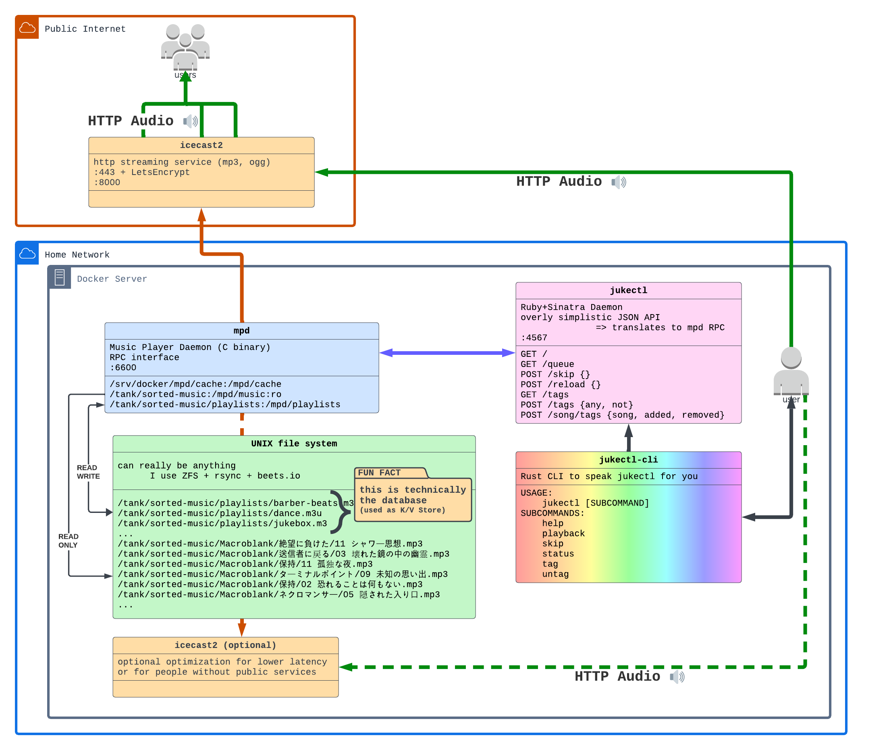

# jukectl

the Rust edition of a lean, UNIX philosophy(ish) utility that uses `mpd` as the Database and Player to be your own private jukebox 🔊🚀

a "Tag" is nothing more than a Key/Value store and a Playlist is nothing more than a Key (Playlist Name) and a set of Values (Files).



## usage

I run it via Docker, an example `docker-compose.yaml` has been provided. batteries not included. 🌩️

the JSON API is **extremely** lean and also Highly Opinionated. I've written a colorful helper CLI to interact with the daemon based on my daily needs.

https://github.com/DanceMore/jukectl-cli

additionally, because the API is so simple, it's fairly easy to glue it into other tools. here is some HomeAssistant configuration to create [RESTful Switch objects](https://www.home-assistant.io/integrations/switch.rest/) to control your radio stations. I use `body_off` to reset the tags to Default Jukebox settings.

```yaml
switch:
  - platform: rest
    name: Morning Radio
    resource: http://jukectl.example.com:4567/tags
    body_on: '{"any":["morning"]}'
    body_off: '{"any":["jukebox"]}'
    is_on_template: "{{ value_json.any[0] == 'morning' }}"
    headers:
      Content-Type: application/json
    verify_ssl: false
  - platform: rest
    name: Barber-Beats Radio
    resource: http://jukectl.example.com:4567/tags
    body_on: '{"any":["barber-beats"]}'
    body_off: '{"any":["jukebox"]}'
    is_on_template: "{{ value_json.any[0] == 'deep-chill' }}"
    headers:
      Content-Type: application/json
    verify_ssl: false
```

## history

what you are seeing here is actually the 3rd or 4th iteration of an idea, where each copy became progressively simpler and simpler.

* the first design was a fully fledged RubyOnRails app with Scaffolding and HTML and data stored in MySQL; the works.
* * but Rails got slow so ... (`n+1` template bugs mainly)
* * I have memories of trying JRuby and even being excited that the JVM offered me an all-in-one packaging solution that Rails did not...

* I decided to try my hand in Sinatra, still using ActiveRecord and an entire Database and HTML templates.
* * but development was still slow; often because I needed to make _entire_ HTML templates where a small JSON response would do
* * and I had lots of bugs and complexity related to Database State differening from MPD's database.

I think there were some other experiments along the way, lost to time and the fog of memory.

eventually I was struck by an idea to make it even leaner; leaner than I'd ever thought possible! 🧙

* Sinatra
* * with JSON input and output only!
* * no Database, only MPD as the backend!

under the hood, a `Tag` is just a `.m3u` playlist that MPD reads and `jukectl` can do the Set() operations in-memory :)

since the switch over to Sinatra+JSON+mpd-as-database, `jukectl` has served me dutifully on a near daily basis for years now :)

in my quest to port everything to Rust, I've finally re-written `jukectl` one more time in:

* Rust + Rocket
* * nearly identical API and responses as `ruby-jukectl`
* * opportunities to extend / improve / de-cruft in a Modern language

even earlier, I was inspired by https://github.com/agius/HackerMusic as well as moving from a spinning-disk iPod to a SmartPhone and needing to stream my music library on the go...


```
TODO:

merge jukectl-cli into this project so I can package and release everything at once

document how to fire the containerized ncurses CLI (which I haven't finished installing / wrapping up)

add environment var for default json tags
  maybe encode in base64 lololol
```
