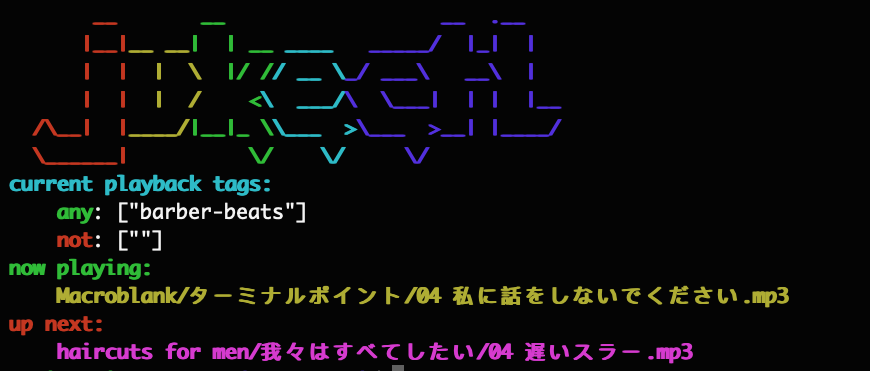

# jukectl-cli

companion CLI tool to interact with the crusty JSON API that is my beloved [jukectl](https://github.com/DanceMore/jukectl)



set ENV `JUKECTL_HOST` to something like `http://my.comtainer.host:4567` and then run it.

```
% jukectl --help
jukectl
command-line remote control for jukectl music player service

USAGE:
    jukectl [SUBCOMMAND]

FLAGS:
    -h, --help       Prints help information
    -V, --version    Prints version information

SUBCOMMANDS:
    help        Prints this message or the help of the given subcommand(s)
    playback    Playback with tags
    skip        Skip an item
    status      display current status of service
    tag         Tag an item
    untag       Untag an item
```
